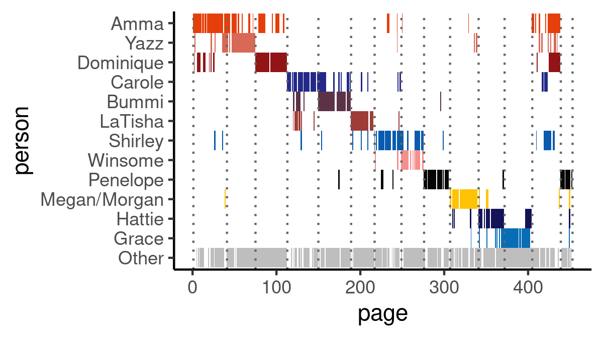
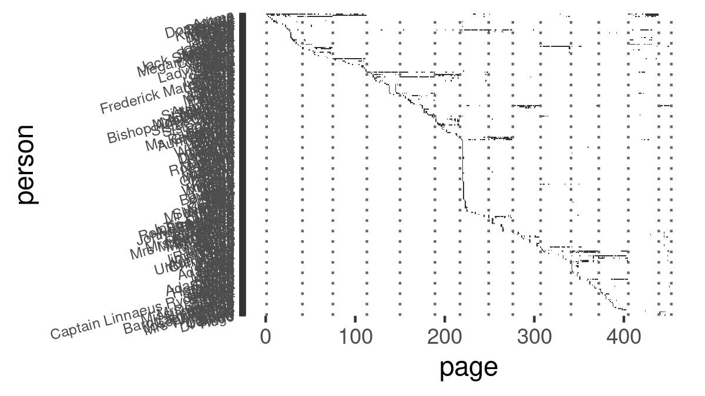

A visual data analysis of the book *Girl, Woman, Other* by Bernardine
Evaristo
================

``` r
library(tidyverse)
```

    ── Attaching packages ─────────────────────────────────────── tidyverse 1.3.2 ──
    ✔ ggplot2 3.3.6      ✔ purrr   0.3.4 
    ✔ tibble  3.1.8      ✔ dplyr   1.0.10
    ✔ tidyr   1.2.1      ✔ stringr 1.4.1 
    ✔ readr   2.1.3      ✔ forcats 0.5.2 
    ── Conflicts ────────────────────────────────────────── tidyverse_conflicts() ──
    ✖ dplyr::filter() masks stats::filter()
    ✖ dplyr::lag()    masks stats::lag()

``` r
# load data
presence <- read_csv("data/presence.csv",  col_types = cols(person = col_factor()))
# set color palette
book_palette <- tribble(
  ~name, ~color,
  "Amma", "#086DB7",
  "Yazz", "#151358",
  "Dominique", "#FEC305",
  "Carole", "#060605",
  "Bummi", "#F68E8D",
  "LaTisha", "#085BAE",
  "Shirley", "#9E3D38",
  "Winsome", "#5C3248",
  "Penelope", "#232989",
  "Megan/Morgan", "#931416",
  "Hattie", "#D76956",
  "Grace", "#E63F0A",
  "Other", "grey"
)
```

The book follows the life of 12 major characters, however there is a
very large number of names mentioned 270.

Few names are mentioned in many pages and many names are mentioned in
very few pages.

``` r
# histogram of pages mentioning people
presence %>%
  group_by(person) %>%
  ggplot(aes(x = fct_lump_n(person, 10))) +
  geom_bar() +
  theme_classic() +
  xlab("") +
  ylab("# pages mentioned")
```


``` r
ggsave("name_histogram.png",
       device = "png",
       path = "images")
```

    Saving 7 x 5 in image


The distribution is close to an exponential.

``` r
# logarithmic plot
presence %>%
  ggplot(aes(x = fct_infreq(person))) +
  geom_bar() +
  scale_y_log10() + 
  xlab("") +
  ylab("# pages mentioned")
```


``` r
ggsave("name_log_plot.png",
       device = "png",
       path = "images",
       width = 1200,
       height = 675,
       units = "px")
```


The story-lines of the 12 main characters are linked in multiple complex
ways, one way to visualize this is to graph the pages where a name is
mentioned and we see that each chapter is devoted mostly to one person
and all story lines are woven together in the end of the book. In the
following plot the x-axis represents the page of the book, and on the
y-axis are listed the 12 main characters, the 13th row labelled ‘Other’
groups together all other names besides the main characters. The colored
bars are pages where the corresponding main character was mentioned at
least one time. Dotted vertical lines denote the chapter limits.

``` r
# main characters story-line
presence %>%
  mutate(person = fct_other(person, keep = book_palette$name)) %>%
  mutate(person = fct_relevel(person, book_palette$name)) %>%
  mutate(person = fct_rev(person)) %>%
  ggplot(aes(y = person, x = page)) +
  geom_tile(aes(fill = person, linetype = "blank"), show.legend = FALSE) +
  geom_vline(
    xintercept = c(1, 41, 75, 113, 150, 189, 217, 249, 276, 307, 341, 372, 405, 439, 453),
    color =
      "grey40",
    linetype = "dotted"
  ) +
  scale_fill_manual(values = c("grey", book_palette$color)) +
  theme_classic()
```


``` r
ggsave("story_lines_main.png",
       device = "png",
       path = "images",
       width = 1200,
       height = 675,
       units = "px")
```



Expanding the ‘Other’ group to show every individual name mentioned
shows the full picture

``` r
# all names mentioned story-line
presence %>%
  mutate(person = fct_rev(person)) %>%
  ggplot(aes(y = person, x = page)) +
  geom_tile(aes(linetype = "blank"), show.legend = FALSE) + theme(axis.text.y = element_text(size = 6, angle = 15)) + geom_vline(
    xintercept = c(1, 41, 75, 113, 150, 189, 217, 249, 276, 307, 341, 372, 405, 439, 453),
    color = "grey40",
    linetype = "dotted"
  )
```


``` r
ggsave("story_line_full.png",
       device = "png",
       path = "images",
       width = 1200,
       height = 675,
       units = "px")
```



## Data colection

I listed all proper names mentioned in each page of the book. I used a
single identifying name for each person, that is I listed under the same
name all mentions by nicknames or alternative names. As alternative name
I counted also references to a person by their relationship (e.g. Mum),
but only if it is capitalized, e.g. *‘my father’*(p.25) is not counted.
I do not count mentions by personal pronouns (‘*she*’). I do count cases
where the is mentioned without referring to the particular person
(e.g. ‘*Shirley’s brothers*’, p27 counts for Shirley). I do not count
famous people referenced or mentioned by a person narrating,
e.g. ‘*although Amma considered her more Artful Dodger than Oliver
Twist*’ (p.30) does not count as a mention of either Artful Dodger nor
Oliver Twist. I do count as names pets (‘*Lady Maisie*’) but not brands
of items (‘*Chanel*’). I do not count possible alternative names, names
that were not used but just suggested, eg “at least she didn’t name
herself Reginald or William (p. 352)

For the first chapter on top of listing names listed per page, I also
counted the number of times a name was printed. I do not count
consecutive mentions with a different alternative name,
e.g. ‘*Sylvester, or Sylvie*’, p31 was counted as 1 mention of Sylvester
